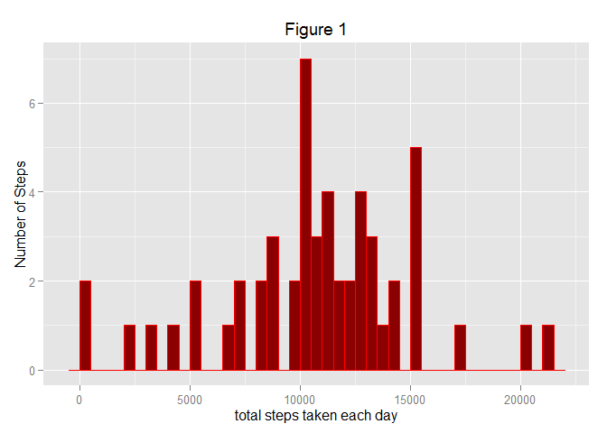
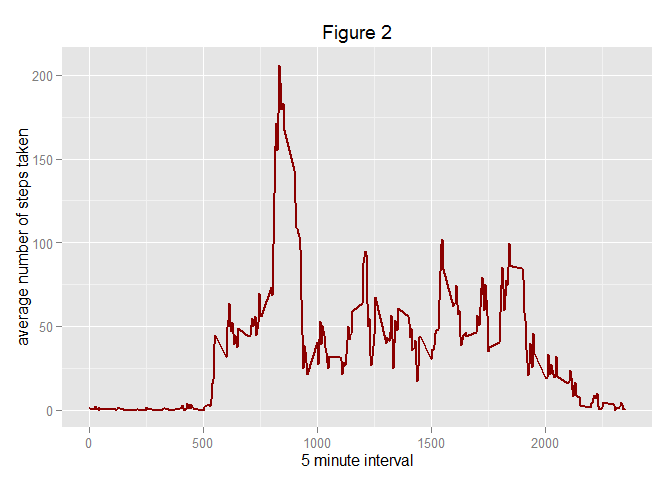
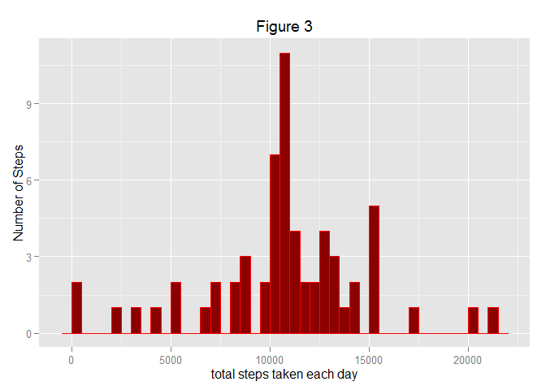
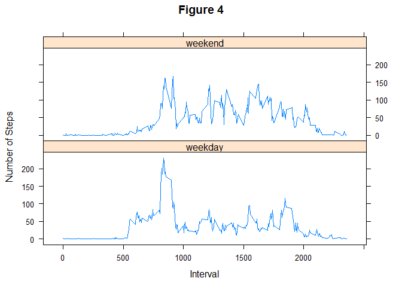

# Reproducible Research: Peer Assessment 1
AsrulNB  
Sunday, September 20, 2015  

## Initialize the environment

```r
rm(list = ls())

library(dplyr)
```

```
## 
## Attaching package: 'dplyr'
## 
## The following objects are masked from 'package:stats':
## 
##     filter, lag
## 
## The following objects are masked from 'package:base':
## 
##     intersect, setdiff, setequal, union
```

```r
library(data.table)
```

```
## 
## Attaching package: 'data.table'
## 
## The following objects are masked from 'package:dplyr':
## 
##     between, last
```

```r
library(ggplot2)

###[ Set working Directory to where the R source file is ]
#this.dir <- dirname(parent.frame(2)$ofile)
this.dir <- "C:/Users/User/Documents/R_work_dir/C05.assignment1"
setwd(this.dir)
```

## Loading and preprocessing the data
> Loading the Data


```r
unzip(zipfile="activity.zip")

DS <- read.csv("activity.csv")
DS <- data.table(DS)
```

## What is mean total number of steps taken per day?

1. Calculate the total number of steps taken per day

```r
sumStep <- group_by(DS,date)
sumStep <- summarise(sumStep,sum(steps))
```

2. Make a histogram of the total number of steps taken each day

```r
g <- ggplot(sumStep,aes(sumStep$`sum(steps)`))
p <- g + geom_histogram(colour="red", fill="darkred",binwidth = 500) + labs(y = "Number of Steps") + labs(x = "total steps taken each day") + labs(title = expression("Figure 1"))

print(p)
```

 

3. Calculate and report the mean and median of the total number of steps taken per day
- Mean for Total Number of Steps per day is

```r
summarise(sumStep,sum(`sum(steps)`,na.rm = TRUE)) / nrow(sumStep)
```

```
##    sum(`sum(steps)`, na.rm = TRUE)
## 1:                         9354.23
```

- Median for Total Number of Steps per day is

```r
summarise(sumStep,median(`sum(steps)`,na.rm=TRUE))
```

```
## Source: local data table [1 x 1]
## 
##   median(`sum(steps)`, na.rm = TRUE)
## 1                              10765
```


## What is the average daily activity pattern?

1. Time Series plot, showing the Average Number of Steps taken all day


```r
avePatern <- group_by(DS,interval)
avePatern <- summarise(avePatern,mean(steps, na.rm = TRUE))

g <- ggplot(avePatern, aes(x=interval, y=avePatern$`mean(steps, na.rm = TRUE)`))
p <- g + geom_line(color = "darkred", lwd = 1) + xlab("5 minute interval") + ylab("average number of steps taken") + labs(title = expression("Figure 2"))

print(p)
```

 

2. Interval containing the most number of steps


```r
avePatern[which.max(avePatern$`mean(steps, na.rm = TRUE)`),]
```

```
## Source: local data table [1 x 2]
## 
##   interval mean(steps, na.rm = TRUE)
## 1      835                  206.1698
```

## Imputing missing values

1. Calculating the number of missing values

```r
# count the total number of rows and minus the one with complete data
nrow(DS) - nrow(na.omit(DS))
```

```
## [1] 2304
```

2. Filling missing data

```r
DS.fill <- DS

# Loop the DataSet DS
for(i in 1:nrow(DS)) {

     # if the Step value is missing
     if (is.na(DS[i]$steps)) {
          #  fill with mean value from avePatern Dataset in Integer format
          DS.fill[i]$steps <- as.integer(avePatern[which(interval == DS.fill[i]$interval ),]$`mean(steps, na.rm = TRUE)`)
     }
}
```

3. Create histrogram to show the new data


```r
# redo the Total Sum by date table
sumStep <- group_by(DS.fill,date)
sumStep <- summarise(sumStep,sum(steps))

# plot the graph
g <- ggplot(sumStep,aes(sumStep$`sum(steps)`))
p <- g + geom_histogram(colour="red", fill="darkred",binwidth = 500) + labs(y = "Number of Steps") + labs(x = "total steps taken each day") + labs(title = expression("Figure 3"))

print(p)
```

 

```r
# Calculate the Mean
summarise(sumStep,sum(`sum(steps)`,na.rm = TRUE)) / nrow(sumStep)
```

```
##    sum(`sum(steps)`, na.rm = TRUE)
## 1:                        10749.77
```

```r
# Calculate the Median
summarise(sumStep,median(`sum(steps)`, na.rm = TRUE))
```

```
## Source: local data table [1 x 1]
## 
##   median(`sum(steps)`, na.rm = TRUE)
## 1                              10641
```

- Does the Values differ from the Estimates from the first part of the assignment?
     - Yes they differ because we are using our best guess to fill in the missing data, making it more reliable

- What is the Impact of Imputing Missing Data on the estimates of the Daily Number of Steps?
     - The Mean for the Data is closer to the Median values

## Are there differences in activity patterns between weekdays and weekends?

1. Create new Variable in Dataset to show Weekdays or Weekend


```r
# Create a new function to determine Weekdays or Weekend
weekType <- function(x) {
     #day <- weekdays(as.Date(x))
     if (x %in% c("Saturday","Sunday")) {
          return("weekend")
     } else {
          return("weekday")
     }
}

# create new Variable "dayType" to store in Dataset DS.fill
DS.fill <- mutate(DS.fill,dayType = "")

# fill in the "dayType" Variable
for(i in 1:nrow(DS.fill)) {
     #  fill with mean value from avePatern Dataset in Integer format
     DS.fill[i]$dayType <- weekType(weekdays(as.Date(DS.fill[i]$date)))
}

DS.fill <- mutate(DS.fill,dayType = as.factor(dayType))
```

2. Make a Time Series Plot like the one in Readme.md


```r
# re calculate the Average Patern
avePatern <- group_by(DS.fill,interval,dayType)
avePatern <- summarise(avePatern,mean(steps))

library(lattice)
xyplot(`mean(steps)`~interval | dayType, data = avePatern,
      type = 'l',
      main = 'Figure 4',
      xlab = 'Interval',
      ylab = 'Number of Steps',
      layout = c(1,2))
```

 

- What are the differences between Weekday and Weekend activity patterns?
     - During Weekdays the graph shows there are more steps taken earlier in the morning
     - During Weekend more steps are recorded during the middle of the day
